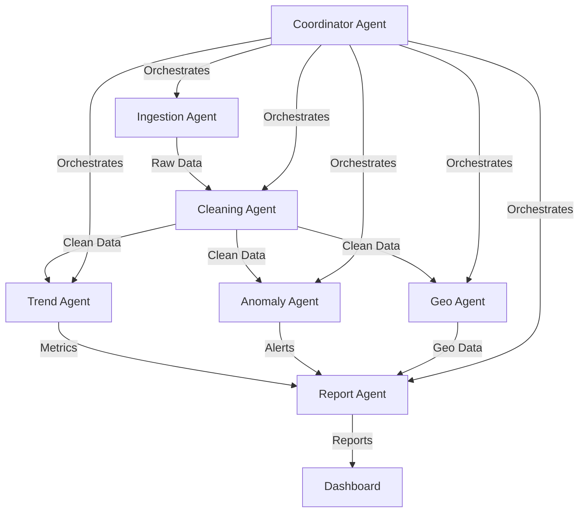

# Aus Housing Watchdog

A multi-agent system for monitoring and analyzing Australian housing market trends and anomalies using Google's Agent Development Kit (ADK).

## 🏗️ Architecture



## 🚀 Quickstart

### Local Development

1. Clone the repository
2. Set up a virtual environment:
   ```bash
   python -m venv .venv
   source .venv/bin/activate  # On Windows: .venv\Scripts\activate
   ```
3. Install dependencies:
   ```bash
   pip install -r requirements.txt
   ```
4. Copy and configure environment variables:
   ```bash
   cp .env.example .env
   # Edit .env with your configuration
   ```
5. Run the pipeline:
   ```bash
   ./scripts/local_run.sh
   ```

### Cloud Run Deployment

1. Build and push the container:
   ```bash
   gcloud builds submit --tag gcr.io/$(gcloud config get-value project)/aus-housing-watchdog
   ```
2. Deploy to Cloud Run:
   ```bash
   gcloud run deploy aus-housing-watchdog --image gcr.io/$(gcloud config get-value project)/aus-housing-watchdog
   ```

## 🤖 Agents

- **Ingestion Agent**: Fetches raw housing data from various sources
- **Cleaning Agent**: Processes and normalizes the raw data
- **Trend Agent**: Analyzes market trends and computes metrics
- **Anomaly Agent**: Detects unusual patterns and outliers
- **Geo Agent**: Handles geographical data aggregation
- **Report Agent**: Generates reports and visualizations
- **Coordinator Agent**: Orchestrates the workflow between all agents

## 📊 Data Sources

- ABS (Australian Bureau of Statistics)
- Domain API (TBD)
- Other real estate data providers (TBD)

## 🤝 Contributing

1. Fork the repository
2. Create a feature branch: `git checkout -b feature/your-feature`
3. Commit your changes: `git commit -am 'Add some feature'`
4. Push to the branch: `git push origin feature/your-feature`
5. Submit a pull request

## 📝 License

This project is licensed under the MIT License - see the [LICENSE](LICENSE) file for details.
